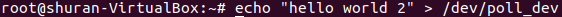
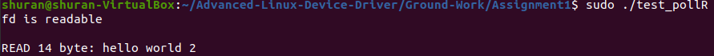
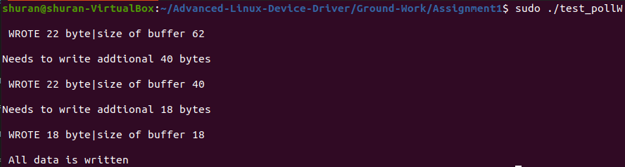
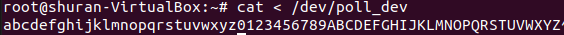
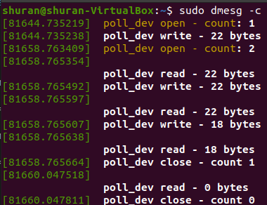
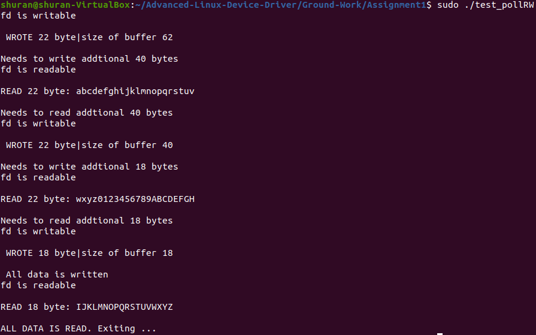
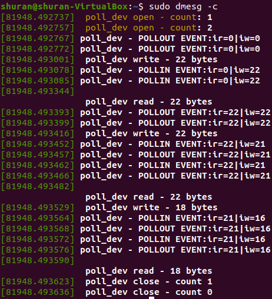

# Assignment #1: Poll( ) entry point implementation

## Program Description

### Helper Functions and Local Variables

1.A wait queue `qout` is declared to store task struct that waits for write operation:

    static DECLARE_WAIT_QUEUE_HEAD(qout); // Wait queue head for write event 

2.A local function `is_buffer_full( )` is defined as the condition function for `device_write()` to poll. Inside `is_buffer_full( )`
we check the if the absolute distance between `ir` and `iw` is equal to `N-1`. If so, the buffer is full. 

3.Inside `device_poll()`, we add the device associated with `filp` to both `qin` and `qout` to register both read and write events. Both
`is_buffer_empty()` and `is_buffer_full()` are checked against to determine the mask.

4.Inside `device_read()`, the original code is modified to hide all the details of adding process to wait queue and checking
condition for wake up by using `wait_event_interruptible()`.

5.Inside `device_write()`, code is added to add device to poll based on the condition `is_buffer_full()` using `wait_event_interruptible()`.

## Program Test Output

1.Output of test_pollR:

We first run `test_pollR` in terminal 2 and then echo words to `/dev/poll_dev` in the terminal 1 and check the output of `test_pollR`:

From terminal 1:

From terminal 2:

2.Output of test_pollW:

A test called `test_pollW` was implemented to check if the driver polls when the buffer is full by writing to the device a char buffer with length much larger than the internal buffer provided. We first run `test_pollW` in terminal 1, and when the program blocks, we read the device buffer via `cat </dev/poll_dev` in terminal 2. We record the dmesg output in terminal 3.

From terminal 1:

From terminal 2:

From terminal 3:

3.Output of test_pollRW

We run `test_pollRW` in terminal 1 and we can see that there is no blocking happened. We record the dmesg output in terminal 2.

From terminal 1:

From terminal 2:

