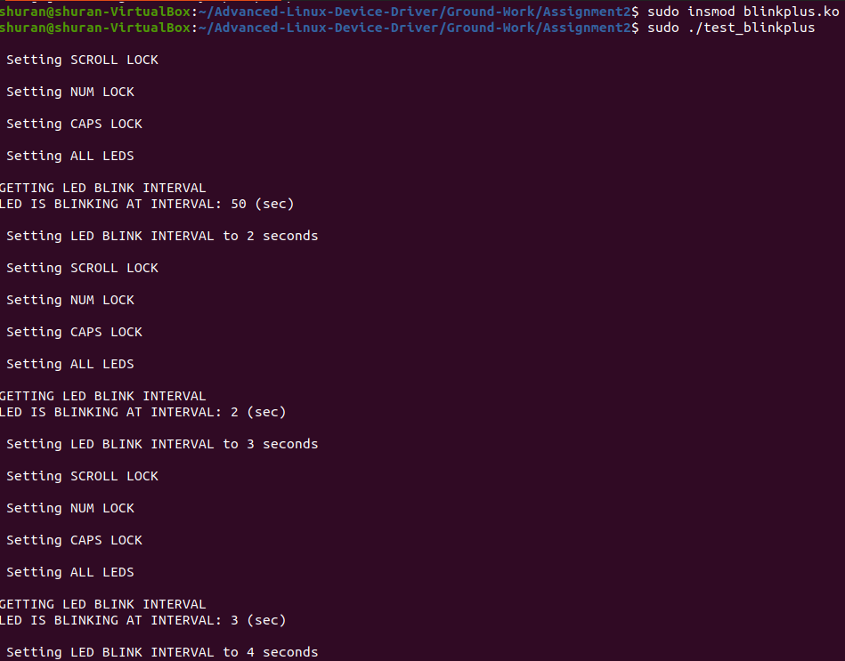
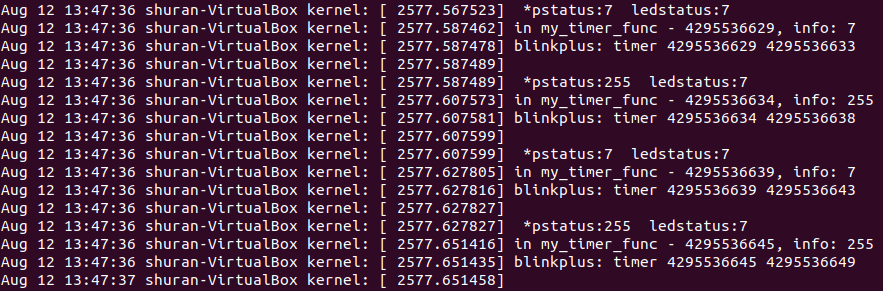

# Assignment #1: blinkplus driver implementation

## Program Description

The program basically patches work of the virtual keyboard's `ioctl()` to the dedicated work queue upon the expiration of the registered timer, which reactivates itself repeatly upon expiration. User programs are free to set keyboard LED control values to be delivered to the virtual keyboard's `ioctl()`. 

`blink_ioctl()` is implemented to support the following commands:

    * SETLED: set the LED value
    * SETINV: set the timer interval value
    * GETINV: get the timer interval value

`copy_to_user()` is used to return data to the userspace and `copy_from_user()` is used to pass the user data to the kernel space.

In the timer callback function `my_timer_func()`, `do_work()`, which is essentially the function to launch the virtual keyboard's `ioctl()`, is registered to be executed by the dedicated work queue via `queue_work()` as follows:

    queue_work(blinkplusptr->info.wq, &blinkplusptr->info.wk);

In addition, the timer's `expires` variable is updated and `add_timer()` is called to reactivate the timer. 

In `work()`, `status` field of `info` is updated and then passed to the virtual keyboard's `ioctl()` as follows: 

    (my_driver->ops->ioctl) (vc_cons[fg_console].d->port.tty, KDSETLED, *pstatus);

The LED status is determined by applying bitwise-AND with `ALL_LEDS_ON` as follows:

    CAP: ALL_LEDS_ON & 0x01
    SCROLL: ALL_LEDS_ON & 0x02
    NUM: ALL_LEDS_ON & 0x04

Finally, `kbleds_init()` is modified to to contain the following:

    * Dynamic allocation of major number 
	* Device node management
    * Dynamic allocation and initialization of dedicated work queue
    * Registration and activation of timer

And `kbleds_cleanup()` is modified to contain the cleanup code for various resources. 

## Program Test Output

`test_blinkplus` is used to perform the testing. In terminal 1 we launch `test_blinkplus` and in terminal 2 we do `tail -f /var/log/syslog`.

From terminal 1:

From terminal 2:

Since the output is pretty long and my keyboard does not have LEDs, here I will only provide a screenshot of a tiny portion of /var/log/syslog:

