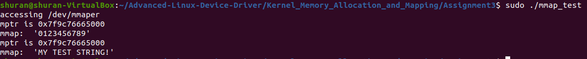
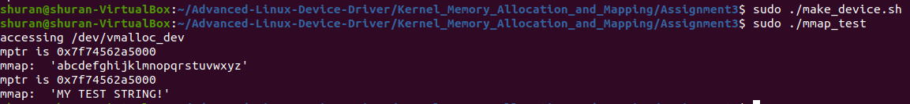
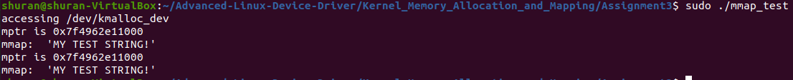
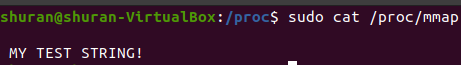

# Assignment #3: Mmap driver implementation

## Program Description

At the module initialization phase (i.e. inside `mmaper_init()`), we performed the following:

    * Creation and initialization of character device and its associated class
    * Allocation of the associated proc entry
    * Initialization and allocation of kernel buffer allocated via `kmalloc()` and `vmalloc()`
        - Allocate buffer via kmalloc()/vmalloc()
        - Mark buffer area as nonswappable
        - Initialized buffer area 

The mapping is achieved in a way that the mapped buffer is dependent to the device being accessed. Specifically, if the device minor number
is a even number, then the buffer allocated via `kmalloc()` is used for the mapping; otherwise the buffer allocated via `vmalloc()` is used.
To be able to perform the mapping, we employed `remap_pfn_range()`. For kmalloc buffer, we just need to call `remap_pfn_range()` once, whereas 
we need to loop over all pages and call `remap_pfn_range()` for each page individuallay.

For read_proc(), the internal kernel buffer content is copied to the user buffer via `sprintf()`. The type of buffer dependents on the device that 
was accessed in the last time.

## Program Test Output

There are 4 tests used to verify the program. The first test program accesses `/dev/mmaper`, the second test program accesses `/dev/kmalloc_dev`,
the third test program accesses `/dev/vmalloc_dev`. For the last test, we perform the following:

    sudo cat /proc/mapp

to check if the content matches the output of the third test program.

Prior to performing tests, we run the following script to create two device nodes upon loading the module:

    sudo ./make_device.sh

This script allocates `/dev/kmalloc_dev` that has the minor number 2 and `/dev/vmalloc_dev` that has the minor number 1.

### Test 1:

We let the program access `/dev/mmaper` and check the result:

### Test 2:

We let the program access `/dev/vmalloc_dev` and check the result:

### Test 3:

We let the program access `/dev/kmalloc_dev` and check the result:

### Test 4:

We perform `sudo cat /proc/mapp` and check the result:

